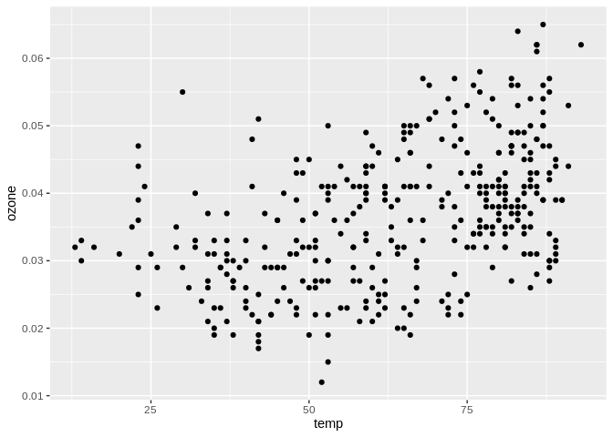
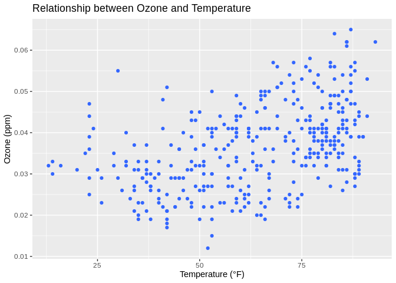
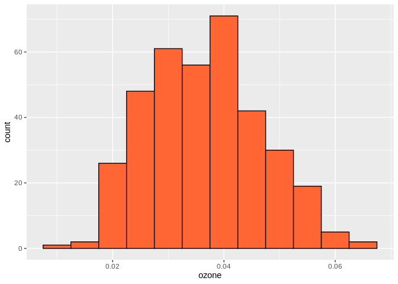
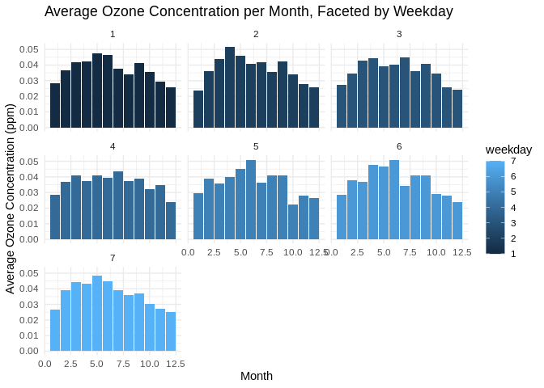

# Plotting with ggplot2

`ggplot2` is a powerful and flexible data visualization package in R. It
uses a layered approach to plot building, which allows you to add,
remove or change components in a straightforward, transparent manner.

To use `ggplot2`, we typically follow a sequence of steps:

1.  Start with the `ggplot()` function where we specify the dataset and
    map variables to aesthetics (visual properties of objects in the
    plot like shapes or colors).
2.  Add `geoms` – geometric objects like points (`geom_point` for
    scatter plots), bars (`geom_bar` for bar plots), or lines
    (`geom_line` for line plots) that determine the type of the plot.
3.  Finally, customize and refine the plot with additional layers like
    labels, themes, facets etc.

Let’s begin by installing and loading the `ggplot2` package. If you
haven’t installed it before, uncomment and run the first line.

``` r
# install.packages('ggplot2')
library(ggplot2)
```

Now we are ready to use `ggplot2` to make some plots\!

## Table of Contents

1. [Introduction to ggplot()](#introduction-to-ggplot-)
1. [Scatter Plot](#scatter-plot)
1. [Customizing the Scatter Plot](#customizing-the-scatter-plot)
1. [Histogram](#histogram)
1. [Faceted Bar Plot](#faceted-bar-plot)
1. [Up Next](#up-next)

## Scatter Plot

For our first plot, let’s create a scatter plot of ozone concentration
(`ozone`) against temperature (`temp`) using the `chicago_air.csv`
dataset.

``` r
# Load the dataset
air_quality <- read.csv('../data/chicago_air.csv')

# Create a scatter plot
ggplot(air_quality, aes(x=temp, y=ozone)) +
  geom_point()
```

<!-- -->

In this example, we have used `geom_point()` to create a scatter plot.
The first argument to `ggplot()` function is the dataset `air_quality`.
The `aes()` function is used to map the `temp` to x-axis and `ozone` to
y-axis.

#### Exercise

Create a scatter plot for the `mtcars` dataset in R, plotting MPG (miles/gallon) on y-axis and disp (Displacement (cu.in.)) on x-axis. Use different colors for different numbers of cylinders (`cyl`).

<details><summary>Click for Hint</summary>

Color can be defined inside `aes()` function

</details>
<details><summary>Click for Hint</summary>

Convert `cyl` to factor before defining color

</details>
<details><summary>Click for Solution</summary>

ggplot(mtcars, aes(x=disp, y=mpg, color=factor(cyl))) +
  geom_point()
      
> This exercise introduces the idea of creating scatter plots with different colors for different categories. The `color` aesthetic within the `aes()` function is used to create different colors for different numbers of cylinders.
</details>

---

## Customizing the Scatter Plot

The plot above is pretty basic. Let’s customize it by adding color,
title and labels.

``` r
# Customized scatter plot
ggplot(air_quality, aes(x=temp, y=ozone)) +
  geom_point(colour='#3366FF') +
  ggtitle('Relationship between Ozone and Temperature') +
  xlab('Temperature (°F)') +
  ylab('Ozone (ppm)')
```

<!-- -->

Here we used `geom_point(colour='#3366FF')` to change the point color,
`ggtitle()` to add a title to the plot and `xlab()` & `ylab()` to label
the x and y axes respectively.

#### Exercise

Customize the scatter plot created in the previous exercise by adding a title and labels for the x and y axes. Use blue color for the data points.

<details><summary>Click for Hint</summary>

Use `ggtitle()` to add a title

</details>
<details><summary>Click for Hint</summary>

Use `xlab()` and `ylab()` to add labels to the x and y axes

</details>
<details><summary>Click for Hint</summary>

You can directly assign the color in `geom_point()`

</details>
<details><summary>Click for Solution</summary>

ggplot(mtcars, aes(x=disp, y=mpg, color=factor(cyl))) +
  geom_point(colour='#3366FF') +
  ggtitle('Relationship between MPG and Displacement') +
  xlab('Displacement (cu.in.)') +
  ylab('MPG (miles/gallon)')
      
> Here, we add labels to the x and y axes using `xlab()` and `ylab()`, a title using `ggtitle()`, and we specify the color of the points using the `color` argument in `geom_point()`. This makes the plot more informative and appealing.
</details>

---

## Histogram

Next, let’s create a histogram of `ozone` concentrations.

``` r
# Histogram
ggplot(air_quality, aes(x=ozone)) +
  geom_histogram(binwidth=0.005, fill='#FF6633', color='black')
```

<!-- -->

Histogram divides the continuous variable into bins (intervals) and
count the number of observations in each bin. So unlike scatter plot,
histogram only needs one variable (`ozone` in this case) which is passed
to x. The `binwidth` argument controls the width of the bins and `fill`
changes the color of the bars.

#### Exercise

Create a histogram for the `airquality` dataset in R, plotting the distribution of `Ozone` (Ozone (ppb)).

<details><summary>Click for Hint</summary>

Use `geom_histogram()` to create a histogram

</details>
<details><summary>Click for Hint</summary>

`binwidth` controls the width of the bars

</details>
<details><summary>Click for Hint</summary>

Change the color of the bars using `fill`

</details>
<details><summary>Click for Solution</summary>

ggplot(airquality, aes(x=Ozone)) +
  geom_histogram(binwidth=5, fill='#FF6633', color='black')
      
> In a histogram, the continuous variable is divided into bins or intervals, and the number of observations in each bin is counted. Here, we create a histogram of ozone levels, specify the binwidth as 5, and change the color of the bars using the `fill` parameter.
</details>

---

## Faceted Bar Plot

Lastly, let’s create a bar plot showing the average `ozone`
concentration for each `month`, and facet it by `weekday`.

First, we need to calculate the average `ozone` concentration per
`month` and `weekday`. We will use `aggregate()` function from base R
for this purpose.

``` r
# Calculate mean ozone concentration per month and weekday
avg_ozone <- aggregate(ozone ~ month + weekday, data = air_quality, FUN = mean, na.rm = TRUE)

# Create faceted bar plot
ggplot(avg_ozone, aes(x=month, y=ozone, fill=weekday)) +
  geom_bar(stat='identity') +
  theme_minimal() +
  facet_wrap(~weekday) +
  labs(title='Average Ozone Concentration per Month, Faceted by Weekday',
       x='Month',
       y='Average Ozone Concentration (ppm)')
```

<!-- -->

Here we are using `geom_bar(stat='identity')` to create a bar plot. The
`facet_wrap()` function creates a series of plots for each level of
`weekday` factor. The `theme_minimal()` gives a clean white background.

#### Exercise

Create a faceted bar plot for `airquality` dataset in R, showing the average `Ozone` for each `Month`, faceted by `Day`. Hint: You can use the `aggregate()` function to calculate the average `Ozone` for each `Month` and `Day` combination.

<details><summary>Click for Hint</summary>

Calculate mean `Ozone` concentration per `Month` and `Day` using `aggregate()`

</details>
<details><summary>Click for Hint</summary>

`geom_bar(stat='identity')` can be used to create a bar plot

</details>
<details><summary>Click for Hint</summary>

The `facet_wrap()` function is used to create multiple plots based on the `Day` factor

</details>
<details><summary>Click for Hint</summary>

`theme_minimal()` gives a clean white background.

</details>
<details><summary>Click for Solution</summary>

avg_ozone <- aggregate(Ozone ~ Month + Day, data = airquality, FUN = mean, na.rm = TRUE)

ggplot(avg_ozone, aes(x=factor(Month), y=Ozone, fill=factor(Day))) +
  geom_bar(stat='identity') +
  theme_minimal() +
  facet_wrap(~Day) +
  labs(title='Average Ozone Concentration per Month, Faceted by Day',
       x='Month',
       y='Average Ozone Concentration (ppb)')
      
> A faceted plot, also known as a trellis plot or small-multiple plot, breaks the data into subsets based on a factor and then applies the same graphical representation to each subset. This makes it easier to compare different groups in the data.
</details>

---

## Exercises

#### Exercise 1

Combine what you've learned to create a faceted scatter plot that shows the relationship between `Wind` and `Solar.R` in the `airquality` dataset, faceted by `Month`. Customize this plot by adding a title and labels to the x and y axes. Use green color for the data points.

<details><summary>Click for Hint</summary>

Use `ggplot()` to define dataset and aesthetics

</details>
<details><summary>Click for Hint</summary>

Use `geom_point()` to define type of the plot

</details>
<details><summary>Click for Hint</summary>

Use `facet_wrap()` to create facets

</details>
<details><summary>Click for Hint</summary>

Add labels using `ggtitle()`, `xlab()`, `ylab()`

</details>
<details><summary>Click for Hint</summary>

Set color directly in `geom_point()`

</details>
<details><summary>Click for Solution</summary>

ggplot(airquality, aes(x=Wind, y=Solar.R)) +
  geom_point(colour='#00CC00') +
  facet_wrap(~Month) +
  ggtitle('Relationship between Wind Speed and Solar Radiation per Month') +
  xlab('Wind Speed (mph)') +
  ylab('Solar Radiation (lang)')
      
> In this exercise, we have combined scatter plot, faceting, and customization techniques taught in the lesson. Faceting has been used to create a subplot for each Month, and the scatter plot visualizes the relationship between Wind Speed and Solar Radiation.
</details>

---

#### Exercise 2

Using the `mtcars` dataset, create a scatter plot of `mpg` (y) against `hp` (x), color the points by number of cylinders (`cyl`), and facet this plot by gearbox (`am`, where 0 = automatic, 1 = manual). Also, add suitable title and axis labels.

<details><summary>Click for Hint</summary>

Use `ggplot()` to define dataset and aesthetics

</details>
<details><summary>Click for Hint</summary>

Use `geom_point()` to define type of the plot

</details>
<details><summary>Click for Hint</summary>

Use `facet_wrap()` to create facets

</details>
<details><summary>Click for Hint</summary>

Add labels using `ggtitle()`, `xlab()`, `ylab()`

</details>
<details><summary>Click for Solution</summary>

ggplot(mtcars, aes(x=hp, y=mpg, color=factor(cyl))) +
  geom_point() +
  facet_wrap(~am) +
  ggtitle('MPG vs. Horsepower, Faceted by Gearbox Type') +
  xlab('Horsepower') +
  ylab('Miles per Gallon')
      
> This exercise reinforces how to use many aspects of `ggplot2` together: scatter plots, aesthetics, faceting, and customizing plots with titles and labels. Faceting facilitates a comparison between automatic and manual gearboxes.
</details>

---

#### Exercise 3

Create a customizable histogram for the `mtcars` dataset, showing the distribution of `mpg` (miles per gallon) for each gearbox type (`am`), where fill color is set to green.

<details><summary>Click for Hint</summary>

Use `geom_histogram()` to create a histogram

</details>
<details><summary>Click for Hint</summary>

`binwidth` controls the width of the bins

</details>
<details><summary>Click for Hint</summary>

Change the color of the bars using `fill`

</details>
<details><summary>Click for Hint</summary>

Use `facet_wrap()` to create facets

</details>
<details><summary>Click for Hint</summary>

Add labels using `ggtitle()`, `xlab()`, `ylab()`

</details>
<details><summary>Click for Solution</summary>

ggplot(mtcars, aes(x=mpg)) +
  geom_histogram(binwidth=2, fill='#00CC00') +
  facet_wrap(~am) +
  ggtitle('Distributions of MPG, Faceted by Gearbox Type') +
  xlab('Miles per Gallon') +
  ylab('Count')
      
> In this exercise, histograms have been used to visualize the distribution of mpg segmented by gearbox type. We controlled the binwidth and set the fill color to green.
</details>

---

## Up Next

In this lesson, we used `ggplot2` to create and customize a variety of
graphics. We covered the basics of the `ggplot()` function structure,
and we practiced creating scatter plots, histograms, and bar plots, and
learned how to facet our plots.

In our [next lesson](../6-Basic-Statistics-in-R), we will move into
calculating common descriptive and inferential statistics such as mean,
median, correlation, confidence intervals, t-tests, ANOVA, and linear
models. We will use these statistical tools to continue exploring and
gaining insights from our air quality datasets\!

